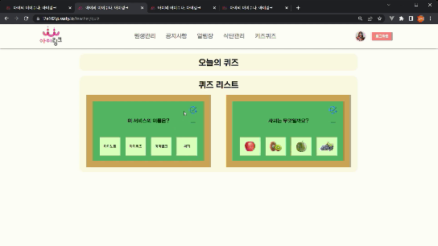

# **🌷 아이와 이어주다 - 아이링크**


## **💜 프로젝트 진행 기간**

2022.07.11(월) ~ 2022.08.18(목)

SSAFY 7기 2학기 공통프로젝트 - **아이링크**


## **🎵 아이링크- 배경**

원과 가정 사이의 소통을 도와줘요!

스스로 모든 것을 하고 싶어하는 모든 아이를 위해 우리 서비스는 만들어졌어요.

아이 혼자서 자신의 하루를 돌아보고 그 날의 기분을 기록해보아요!

매일 기록한 일상이 선생님과 부모님에게 전달되어 모두의 기억이 될 수 있게 해줄게요.


## **💜 아이링크- 개요**

**아이링크는** 선생님과 부모님과의 정보 교환과 양방향 소통 기능을 지원함과 동시에

개인 별 학습 진행 상황,  하루의 일기 등을 통해 아이들의 자발적인 참여를 유도해요 !


## **💜 주요 기능**


- 키오스크
    - 바쁜 아침 잊은 건 없을까 준비물을 다시 한번 체크해 보아요.
    - 보육 시설의 공지 사항을 확인할 수 있어요.
    - 오늘의 날씨와 식단, 간식을 확인할 수 있어요.
- **키즈 설문**
    - 오늘 유치원에서 무슨 일이 있었는지, 기분은 어떤지 부모님과 공유해봐요.
    - 설문을 통해 부모님들은 아이가 안전하게 집에 도착했는지 확인할 수 있어요.
    - 오늘 아이의 기분이 어떤지, 특별한 일은 없었는지, 웹으로 확인할 수 있어요.
- **칭찬 스티커**
    - 키즈 설문, 방과 후 퀴즈 등으로 아이의 참여를 유도할 수 있어요 !
    - 칭찬 스티커 개수에 따라 다양한 보상이 있어요 !
- **유치원**
    - 유치원에서 아이의 정보 관리를 편리하게 할 수 있어요!
    - 가정에서 유치원에 등원 시 전달 사항을 간단하게 전달할 수 있어요.(복용 약,하원 시 픽업 유무 등)
    - 유치원에서도 아이들 특이 사항을 한눈에 볼 수 있어요 !

## **✔ 주요 기술**


**Backend - Node.js 16.15.0**

- Express.js 4.18.1
- Bcrypt 5.0.1
- JWT 8.5.1
- Swagger-jsdoc 6.2.3
- Swagger-ui-express 4.5.0
- Sequelize 6.21.3
- MySQL 2.3.3
- Redis 4.2.0
- Multer 1.4.5

**Backend - DB**

- MySQL 8.0.29
- Redis 7.0.4

**Frontend**

- Visual Studio Code IDE
- React 18.2
- MUI 5.9.3
- Context API
- Axios 0.27.2
- Styled-component 5.3.5
- react-router-dom 6.3.0
- react-daum-postcode 3.1.1

**CI/CD**

- AWS EC2
- Jenkins
- NGINX
- PM2

## **✔ 프로젝트 파일 구조**


### **Back**

```
i_link/back/app
  ├── config
  │   ├── db
  │   ├── redis
  │   └── swagger
  ├── controller
  │   ├── center
  │   ├── group
  │   ├── memos
  │   └── user
  ├── model
  │   ├── centers
  │   ├── files
  │   ├── groups
  │   ├── index
  │   ├── init-moodels
  │   ├── kids
  │   ├── meals
  │   ├── memos
  │   ├── notices
  │   ├── quiz_images
  │   ├── quiz_results
  │   ├── quiz
  │   ├── report_types
  │   ├── reports
  │   ├── surveys
  │   ├── user_types
  │   └── users
  ├── routes
  │   ├── centers
  │   ├── groups
  │   ├── index
  │   ├── kids
  │   ├── meals
  │   ├── members
  │   ├── memos
  │   ├── notices
  │   ├── quiz
  │   ├── reports
  │   ├── stamps
  │   ├── surveys
  │   └── users
  ├── utils
  │   └── attachment
  │   └── auth
  │   └── meals
  │   └── profile
  │   └── quiz
  └── app.js
```

### **Front**

```

i_link/front
  ├── config
  ├── node_modules
  ├── public
  └── src
      ├── api
      ├── components
      │   ├── Calendar
      │	  │   ├── Day
      │	  │   ├── DietInsert
      │	  │   ├── Month
      │	  │   ├── MonthMove
      │	  │   └── Week
      │   ├── Center
      │   ├── Common
      │   ├── Detail
      │	  │   ├── Parents
      │	  │   │   └──FeelPng
      │	  │   └── Teacher
      │   │       ├──StudentInfo
      │	  │ 	  ├──StudentMemo
      │	  │ 	  └── StudentReport 
      │   ├── Group
      │	  │   ├── GroupDetail
      │	  │   ├── GroupInsert
      │	  │   ├── GroupListItem
      │	  │   └── GroupManagement
      │   ├── GroupBar
      │   ├── Kids
      │	  │   ├── RegistKids
      │	  │   ├── RegistKidsList
      │	  │   └── RegistKidsLists
      │   ├── Meal	
      │	  │   ├── Kiosk
      │	  │   └── KioskSnack
      │   ├── Member
      │	  │   ├── Student
      │	  │   │   ├──Report
      │	  │   │   └──ReportDetailView
      │	  │   └── Teacher
      │   ├── Memo
      │	  │   └──Kiosk
      │	  ├── MenuBar
      │	  ├── Notice
      │	  ├── Parents
      │	  │   ├──ParentsKids
      │	  │   ├──SelectKidKiosk
      │	  │   └──SelectKidWeb
      │	  ├── Quiz
      │	  │   ├──KioskChoice
      │	  │   ├──KioskChoices
      │	  │   ├──KioskQuestion
      │	  │   ├──QuizForm
      │	  │   ├──QuizFrame
      │	  │   ├──QuizInsertModal
      │	  │   ├──QuizSolForm
      │	  │   └──QuizStampFrame
      │	  ├── Reports
      │	  │   ├──RepoItem
      │	  │   ├──RepoItemList
      │	  │   └──RepoModal
      │	  ├── Stamp
      │	  ├── Survey
      │	  ├── TTSButton
      │	  ├── User
      │	  │   ├──KioskLogin
      │	  │   ├──KioskLogout
      │	  │   ├──Login
      │	  │   ├──Logout
      │	  │   ├──SignUp
      │	  │   └──Update
      │	  └──Weather
      │       └──Clock
      ├──constants
      ├── context
      ├── layout
      │	  ├── Header
      │	  ├── KioskLayout
      │	  └── WithoutHeader
      ├── pages
      │	  ├── Common
      │	  ├── Error
      │	  ├── Kiosk
      │	  │   ├──Login
      │	  │   ├──Main
      │	  │   ├──Quiz
      │	  │   ├──Stamp
      │	  │   └──Survey
      │	  ├── Master
      │	  │   ├──Diet
      │	  │   ├──ManageGroup
      │	  │   ├──ManageMember
      │	  │   ├──Memo
      │	  │   ├──Notice
      │	  │   └──RegistAcademy
      │	  ├── Parents
      │	  │   ├──Diet
      │	  │   ├──Home
      │	  │   ├──JoinCenter
      │	  │   ├──Notice
      │	  │   ├──Quiz
      │	  │   ├──RegistKid
      │	  │   └──Repo
      │	  ├── Teacher
      │	  │   ├──Detail
      │	  │   ├──Diet
      │	  │   ├──JoinCenter
      │	  │   ├──Management
      │	  │   ├──Memo
      │	  │   ├──Quiz
      │	  │   └──Wait
      │	  └── User
      │       ├──Login
      │       ├──SignUp
      │       └──Update
      ├── App.js
      ├── commonFuction
      └── index
     
```

## **✔ 협업 툴**


- Gitlab
- Notion
- Jira
- Discord

## **✔ 협업 환경**


- Gitlab
    - 코드의 버전을 관리
    - 이슈 발행, 해결을 위한 토론
    - MR시, 팀원이 코드 리뷰를 진행하고 피드백 게시
- JIRA
    - 매주 목표량을 설정하여 Sprint 진행
    - 업무의 할당량을 정하여 Story Point를 설정하고, In-Progress -> Done 순으로 작업
- 회의
    - Discord 스탠드업 회의 진행, 당일 할 업무 브리핑
    - Discord 마무리 회의 진행, 당일 업무 진행 브리핑, 다음 날 진행할 업무 브리핑
    - 빠른 소통과 신속한 대응이 가능
- Notion
    - 회의가 있을 때마다 회의록을 기록하여 보관
    - 회의가 길어지지 않도록 다음날 제시할 안건을 미리 기록
    - 기술 확보 시, 다른 팀원들도 추후 따라할 수 있도록 보기 쉽게 작업 순서대로 정리
    - 컨벤션 정리
    - 간트 차트 관리
    - 규칙, 기능 명세서 등 모두가 공유해야 하는 문서 관리

## **✔ 팀원 역할 분배**

| 이름 | 직책 | 파트 | 업무 |
| --- | --- | --- | --- |
| 강민재 | 팀장 | FE | KIOSK 담당, 전역 상태 관리 |
| 안정현 | 팀원 | FE | WEB 담당, 메인 페이지, 회원관리 페이지, 특이사항 페이지, UCC 담당 |
| 김국진 | 팀원 | FE | Web 담당, 메인 페이지, 식단관리 페이지, 퀴즈 페이지, 반관리 페이지 |
| 배지우 | 팀원 | FE | WEB 담당, 공지사항 페이지, 알림장 페이지, 유치원등록 페이지 |
| 송형근 | 팀원 | BE | AWS/Jenkins Setting, 서비스 API 개발, 문서, 컨벤션 관리 |
| 이소영 | 팀원 | BE | DB Setting, 서비스 API 개발, 사용자 인증 |

## **✔ 프로젝트 산출물**


- [컨셉 기획 및 디자인](https://chrome-thief-e28.notion.site/ce80acbe0e724574ac6667c69a8df4e2)
- [기능명세서](https://chrome-thief-e28.notion.site/9aa7aed850d34327824a47bdd80b6361)
- [WBS](https://chrome-thief-e28.notion.site/d9937a5a29824281adac35ebde340e21)
- [와이어프레임](https://www.figma.com/file/N2hX0Yex6XTZxVnB1cd1Zf/Untitled?node-id=0%3A1)
- [아키텍처](https://www.figma.com/file/t3TTNzAe0xUSVvttbgbBHW/Untitled?node-id=0%3A1)
- [API 명세서](https://chrome-thief-e28.notion.site/c73e7a5d4f524c79bb71298f5e5f622d)
- [ERD](https://www.erdcloud.com/d/LSiXoytFWdnx7DbqD)
- [컨벤션](https://chrome-thief-e28.notion.site/ab79ef5934984be7a273d94203f74751)
- [트러블 슈팅](https://chrome-thief-e28.notion.site/6198e6bdd87649f2b85bd40e56a8fa61?v=2cfa62ec34f94fb2b06696baebd7e1a4)

## **✔ 프로젝트 결과물**

- [사용매뉴얼](https://drive.google.com/file/d/1l-Lys8dGtY5_s4iBlFcDxaQowIn_24TT/view?usp=sharing)
- [포팅매뉴얼](https://docs.google.com/document/d/10003uM5WJNu9KX3JPZleELapDk2o1Yp9dN2DRlZAbcM/edit?usp=sharing)
- [중간발표자료](https://docs.google.com/presentation/d/1t5iPXE_KGjOoJk-zvma17btQpl48ymC5bX7pnzBlOgc/edit?usp=sharing)
- [최종발표자료](https://docs.google.com/presentation/d/1NiSj9vUSFG0veN--SHTnRUA2tDIM5enbgn8hxETQWT0/edit?usp=sharing)

## **✔ 시연 GIF**

### 원장  
- 로그인  
  
- 가입승인   
   
- 공지사항  
  
- 반관리  
  
- 알림장  
  
- 식단관리  
  

### 선생  
- 로그인  
  
- 특이사항 확인  
  
- 등원완료 체크  
  
- 공지사항 작성 및 삭제   
   
- 공지사항 확인  
  
- 식단 등록 및 삭제  
    
- 알림장 등록  
  
- 퀴즈 등록  
  
- 오늘의퀴즈 등록  
  

### 학부모  
- 로그인  
  
- 아이등록  
  
- 아이변경  
  
- 식단간식   
   
- 공지사항  
  
- 특이사항  
  


### 아이  
- 키오스크 메인  
  
- 키오스크 프로필 변경   
  
- 키오스크 오후 아이설문  
  
- 키오스크 오후 아이퀴즈  
  
- 키오스크 오후 칭찬스티커  
  
